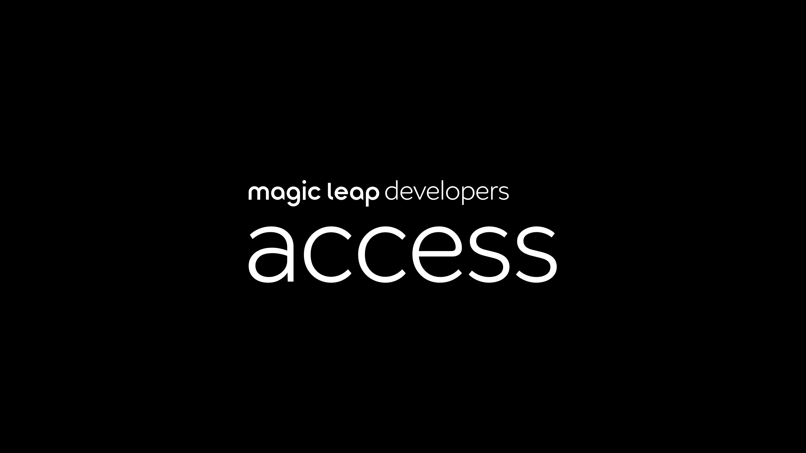

# Peter Moss COVID-19 AI Research Project

## COVID-19 AR Magic Leap Medical Support System

 

# Introduction
COVID-19 AR Magic Leap Medical Support System is a Augmented (AR)/Mixed Reality (MR, Artificial Intelligence (AI) & Internet of Things (IoT) R&D project.

The project will display chest x-rays in mix reality and medical staff will  be able to identify COVID-19 negative and positive x-rays in realtime mixed reality.

&nbsp;

# Magic Leap Developer Access

We've been accepted into the @MagicLeap Access Hardware program to work on (INSERT APP DESCRIPTION HERE). We’ll be getting support from @magicleapdevs and hardware to help create a spatial application. If you're an XR creator, consider applying for Access Hardware and start building with us and Magic Leap. [https://magi.ca/hcs](https://magi.ca/hcs "https://magi.ca/hcs")

## Access Hardware

Access Hardware is an initiative to put Magic Leap devices in the hands of developers who are serious about publishing applications with Magic Leap. Plus, you get support from Magic Leap developer relations team. Once your app is ready it will be prioritized for publishing. [Source](https://www.magicleap.com/en-us/news/for-creators/announcing-magic-leap-developer-access-programs-and-dates-for-leap "Source")

&nbsp;

# COVID-19 AR Magic Leap Medical Support System 0.1.0

You can keep up to date with the latest code on the current dev branch, 0.1.0. The current version and dev branch are always noted at the top of the README in the project root of all of our repositories.

&nbsp;

# Contributing

The Peter Moss Acute Myeloid & Lymphoblastic Leukemia AI Research project encourages and welcomes code contributions, bug fixes and enhancements from the Github.

Please read the [CONTRIBUTING](https://github.com/COVID-19-AI-Research-Project/COVID19-AR-Magic-Leap-Medical-Support-System/blob/master/CONTRIBUTING.md "CONTRIBUTING") document for a full guide to forking our repositories and submitting your pull requests. You will also find information about our code of conduct on this page.

## Contributors

- **AUTHOR:** [Adam Milton-Barker](https://www.leukemiaresearchassociation.ai//team/adam-milton-barker "Adam Milton-Barker") - [Peter Moss Leukemia AI Research](https://www.leukemiaresearchassociation.ai "Peter Moss Leukemia AI Research") Founder & Intel Software Innovator, Sabadell, Spain

&nbsp;

# Versioning

We use SemVer for versioning. For the versions available, see [Releases](https://github.com/COVID-19-AI-Research-Project/COVID19-AR-Magic-Leap-Medical-Support-System/releases "Releases").

&nbsp;

# License

This project is licensed under the **MIT License** - see the [LICENSE](https://github.com/COVID-19-AI-Research-Project/COVID19-AR-Magic-Leap-Medical-Support-System/blob/master/LICENSE "LICENSE") file for details.

&nbsp;

# Bugs/Issues

We use the [repo issues](https://github.com/COVID19-Medical-Support-System-Server/issues "repo issues") to track bugs and general requests related to using this project. See [CONTRIBUTING](https://github.com/COVID19-Medical-Support-System-Server/blob/master/CONTRIBUTING.md "CONTRIBUTING") for more info on how to submit bugs, feature requests and proposals.